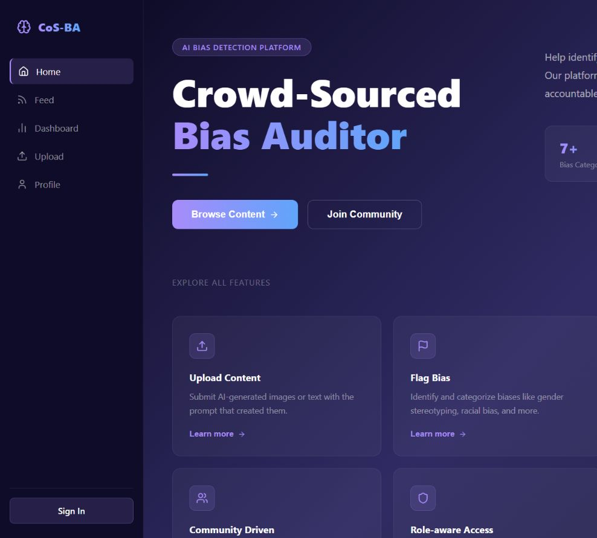
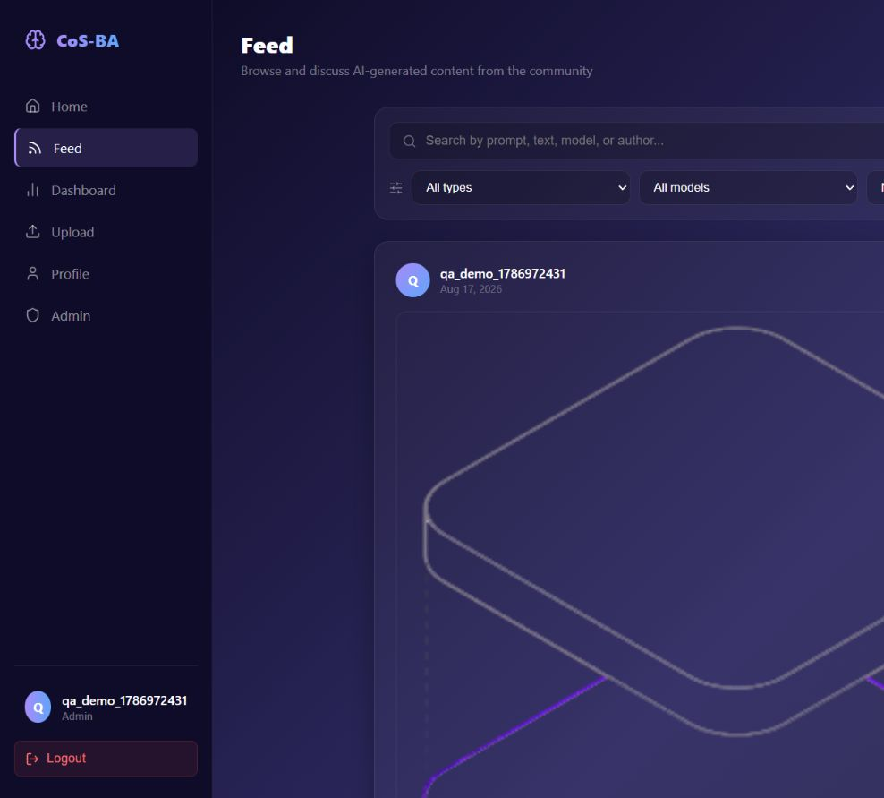
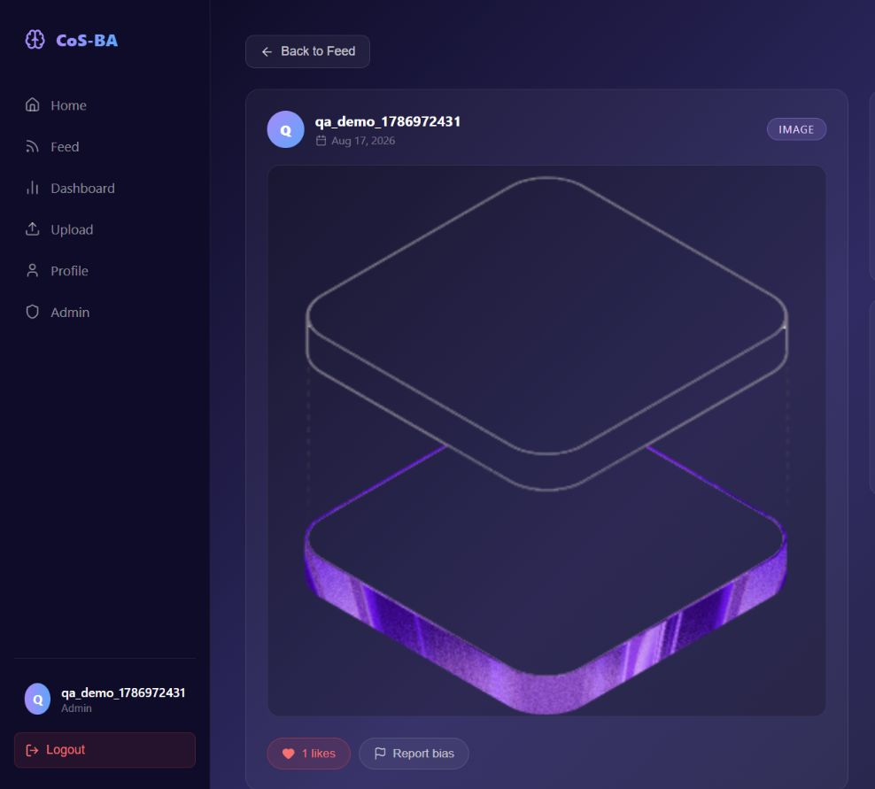
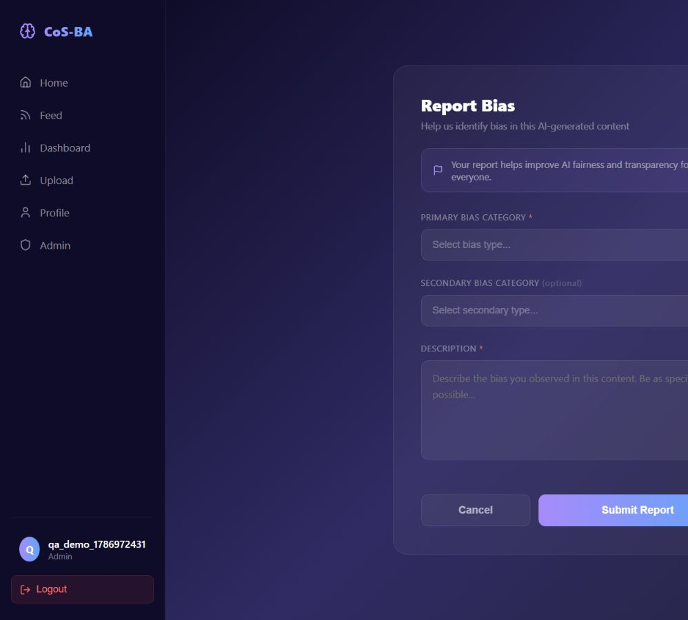
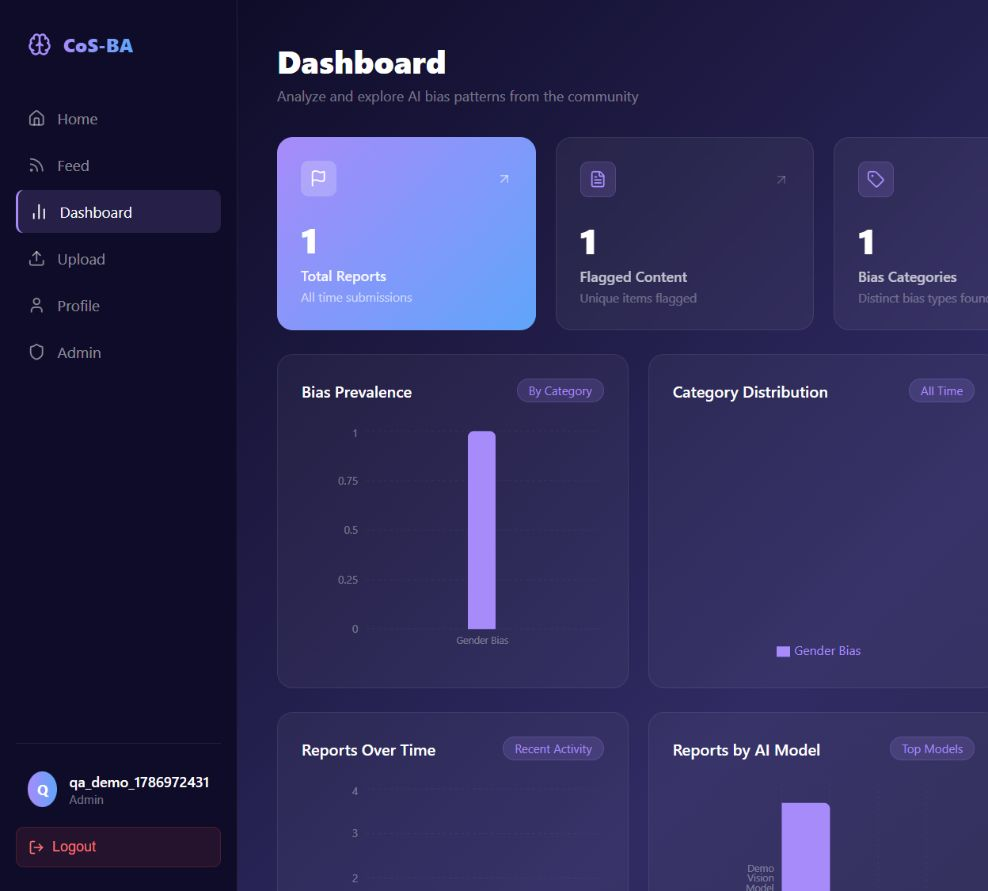
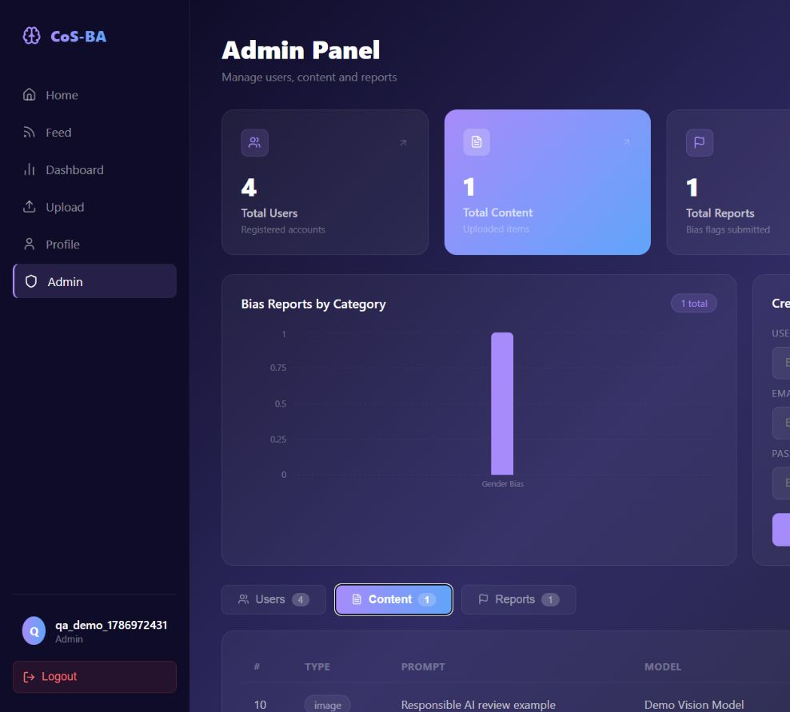

# CoS-BA Bias Auditor

[](https://github.com/AdamWaleedHatemHossamElden/cosba-bias-auditor/actions/workflows/ci.yml)

CoS-BA Bias Auditor is a full-stack community platform for examining bias in AI-generated content. It gives users a place to share generated text and media with their prompts and model details, discuss and flag potential bias, and explore the resulting report data; administrators can then review submissions and manage the moderation workflow from a dedicated panel.

> **Project status:** Completed individual BSc (Hons) Computer Science final-year project — awarded **86/100**.

## Purpose

Generative AI can reproduce stereotypes and other harmful patterns, while the evidence around individual outputs is often scattered or difficult to compare. CoS-BA provides a structured reporting workflow that connects an AI output to its prompt, model, community discussion, bias classifications, and moderation status. Its dashboard then turns those reports into aggregate views that make recurring patterns easier to inspect.

## Key Features

- Account registration, login, profile editing, and JWT-based sessions
- User and administrator roles with protected API operations
- Submission of AI-generated text, images, PDFs, and MP4 files
- Prompt and AI model metadata attached to each submission
- Community feed with search, content-type and model filters, and sorting
- Content detail pages with likes and discussion
- Owner-only editing and deletion for comments, plus owner-only content deletion
- Bias reports with primary and optional secondary categories and descriptions
- Report workflow statuses: `pending`, `reviewed`, `resolved`, and `dismissed`
- Public analytics for categories, models, content types, timelines, report status, consensus, and frequently flagged prompts
- User profiles showing personal uploads and report history
- Admin tools for user, content, and report management

## How the Platform Works

1. A visitor can browse community submissions and aggregate bias analytics.
2. A registered user signs in and uploads an AI-generated text item or supported file, together with its prompt and model information.
3. Community members open the submission to like it, discuss it, or create a structured bias report.
4. Reports contribute immediately to the dashboard's aggregated metrics and appear in the reporting user's profile.
5. An administrator reviews the moderation queue, updates report statuses, and can manage users, content, and reports.

## Application Preview

These screenshots were captured from the running local application with disposable demonstration data. Capture details are documented in [`docs/screenshots/`](./docs/screenshots/README.md).

| Home | Community Feed |
| --- | --- |
|  |  |

| Content Detail | Bias Report |
| --- | --- |
|  |  |

| Analytics Dashboard | Administration |
| --- | --- |
|  |  |

## Technology Stack

| Layer | Technologies |
| --- | --- |
| Frontend | React, Vite, React Router, Axios, Recharts, Lucide React |
| Backend | Node.js, Express, Multer, express-validator |
| Authentication | JSON Web Tokens (JWT), bcryptjs |
| Database | MySQL, mysql2 connection pool |
| Styling | Responsive CSS and component-level style objects |

## Technical Architecture

CoS-BA uses a conventional client-server architecture:

```text
React single-page application
        |
        | Axios / JSON / multipart form data
        v
Express REST API
        |-- route middleware (JWT, role checks, uploads)
        |-- controllers (application and moderation logic)
        |-- local uploads directory (development file storage)
        v
MySQL relational database
```

The Vite client owns navigation and presentation. Axios sends API requests and attaches the stored bearer token when one is available. Express routes apply authentication, authorization, validation, and Multer upload handling before controller functions use parameterized queries through a MySQL connection pool. Uploaded files are served from `/uploads` during local development.

## Authentication and Authorization

- Passwords are hashed with bcrypt before storage.
- Successful login returns a signed JWT containing the user ID and role; tokens expire after seven days.
- The client persists the token and basic user details in `localStorage` and sends the token as `Authorization: Bearer <token>`.
- Backend middleware verifies protected requests and separately enforces administrator-only endpoints.
- The client redirects signed-out users away from protected pages and hides the admin workflow from non-admin users; the API remains the authoritative access-control layer.
- Ownership is included in the database queries used to update/delete comments and delete a user's own content.

## Data Model

The schema is defined in [`server/schema.sql`](./server/schema.sql) and contains five related tables:

| Table | Purpose | Main relationships |
| --- | --- | --- |
| `users` | Accounts and `user`/`admin` roles | Owns content, reports, comments, and likes |
| `content` | Generated text or uploaded media plus prompt/model metadata | Belongs to a user; has reports, comments, and likes |
| `reports` | Structured bias category, description, and workflow status | Belongs to a user and a content item |
| `comments` | Discussion attached to content | Belongs to a user and a content item |
| `likes` | Per-user content reactions | Unique per user/content pair |

Foreign keys use cascading deletion to keep dependent records consistent when a parent user or content item is removed.

## Main Frontend Routes

| Route | Access | Purpose |
| --- | --- | --- |
| `/` | Public | Landing page and feature overview |
| `/login`, `/register` | Public | Account access and creation |
| `/feed` | Public | Browse, search, filter, and sort content |
| `/content/:id` | Public | View an item, its metadata, likes, and comments |
| `/dashboard` | Public | Explore aggregate bias-report analytics |
| `/upload` | Signed-in user | Submit generated content |
| `/report/:id` | Signed-in user | Report bias in a content item |
| `/profile` | Signed-in user | Manage profile and personal submissions/reports |
| `/admin` | Administrator | Moderate users, content, and reports |

## Main API Areas

| Prefix | Responsibilities |
| --- | --- |
| `/api/auth` | Registration, login, current user, and profile updates |
| `/api/content` | Public content reads and authenticated upload/ownership operations |
| `/api/comments` | Content discussions and owner-controlled updates/deletes |
| `/api/likes` | Authenticated like toggling and like state/counts |
| `/api/reports` | Report submission, personal history, report listing, and dashboard metrics |
| `/api/admin` | Administrator-only user, content, and report moderation |

## Project Structure

```text
cosba-bias-auditor/
|-- client/
|   |-- public/             # Static icons and favicon
|   |-- src/
|   |   |-- assets/         # Application imagery
|   |   |-- components/     # Shared navigation and route guards
|   |   |-- context/        # Authentication state
|   |   |-- pages/          # Route-level React views
|   |   `-- services/       # API and upload URL helpers
|   `-- .env.example
|-- server/
|   |-- config/             # MySQL connection-pool configuration
|   |-- controllers/        # Request and database logic
|   |-- middleware/         # Authentication/authorization
|   |-- routes/             # Express route definitions
|   |-- uploads/            # Ignored runtime uploads (.gitkeep only)
|   |-- schema.sql
|   `-- .env.example
|-- docs/screenshots/       # Preview capture guidance
|-- SETUP.md
`-- LICENSE
```

## Local Setup

Prerequisites are Node.js/npm, MySQL, and the MySQL command-line client. Full cross-platform and Windows PowerShell instructions are in [`SETUP.md`](./SETUP.md).

In summary:

1. Install dependencies in both `server/` and `client/`.
2. Copy both `.env.example` files to `.env` and supply local values.
3. Import `server/schema.sql` into MySQL.
4. Start the backend, then start the Vite frontend in a second terminal.

## Environment Configuration

Never commit real `.env` files. The repository tracks examples for each application:

### Backend — `server/.env`

| Variable | Description | Example |
| --- | --- | --- |
| `PORT` | Express listen port | `5000` |
| `CLIENT_URL` | Frontend origin allowed by CORS | `http://localhost:5173` |
| `DB_HOST` | MySQL host | `localhost` |
| `DB_PORT` | MySQL port | `3306` |
| `DB_USER` | MySQL account | `root` |
| `DB_PASSWORD` | MySQL account password | Local value |
| `DB_NAME` | Database created by the schema | `cos_ba` |
| `JWT_SECRET` | Secret used to sign and verify JWTs | Long random value |

### Frontend — `client/.env`

| Variable | Description | Example |
| --- | --- | --- |
| `VITE_API_URL` | Base URL for API requests | `http://localhost:5000/api` |

Restart the relevant development server after changing environment variables.

## Implemented Security Measures

- bcrypt password hashing and seven-day signed JWTs
- Backend authentication and role-based administrator middleware
- Configurable single-origin CORS policy for the frontend
- Parameterized MySQL queries throughout the controllers
- Server-side validation for authentication, profile, admin-account, report, and comment inputs
- Ownership-scoped content and comment mutations
- Upload allow-list for JPG, PNG, WEBP, GIF, PDF, and MP4 MIME types, with file cleanup when content is deleted
- 25 MB upload limit and normalized server-side filenames
- Unique database constraint preventing duplicate likes by one user on one item
- Real environment files, dependencies, build output, and runtime uploads excluded through `.gitignore`

## Known Limitations and Production Considerations

This repository represents a completed university project and a local development deployment, not a production service. A production rollout would need additional work, including:

- Durable object storage instead of the server's local filesystem
- HTTPS, security headers, and deployment-specific secrets management
- Stronger account protections such as rate limiting, email verification, password recovery, and token revocation/refresh
- A safer browser session strategy to reduce the impact of cross-site scripting on tokens stored in `localStorage`
- Deeper validation and sanitization across all content/report/profile fields, plus file-content inspection beyond MIME checks
- Pagination for growing feeds and administration tables
- A versioned migration strategy if the database schema evolves beyond this completed project
- Automated unit, integration, and end-to-end tests; no automated test suite is currently included
- Monitoring, structured logging, backup, and recovery procedures

## Future Possibilities

These are optional directions rather than incomplete promised features:

- Research-driven report-quality or inter-rater agreement measures
- More granular analytics filters and exportable research datasets
- Accessibility and responsive-layout audits across a broader device range
- Managed media storage and deployment automation for a hosted demonstration
- A documented API contract and automated regression suite

## License

This project is available under the [MIT License](./LICENSE).
